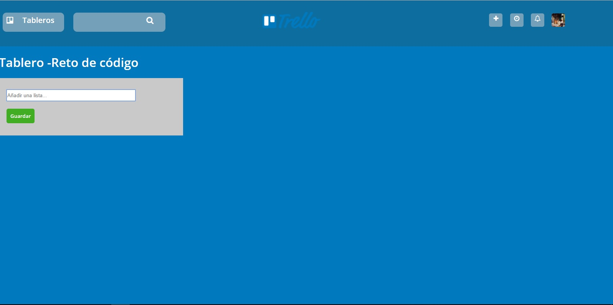

# Proyecto Trello

## Descripción del proyecto

El siguiente reprositorio contiene el desarrollo de las funcionalidades básicas de la página web Trello, por medio de una estructura semántica con HTML, estilos con CSS y finalmente la aplicación de eventos con Javascript.

## Herramientas utilizadas:

1. HTML5

2. CSS3

3. JS

## Estructura

Este proyecto cuenta con las seis versiones requerias:

### Versión 0.0.1

Muestra el texto "Añadir una lista ...".
Al hacer click se oculta el texto y muestra un formulario.
El formulario está conformado por un input y un botón para añadir tareas a la lista.

### Versión 0.0.2

Al dar click en el botón de "Guardar", se muestra un nuevo cuadro donde está el nombre de la lista agregada.
Se muestra un enlace de "Añadir una tarea" dentro de la lista.

### Versión 0.0.3

Al dar click en "Añadir una tarea", muestra un formulario con un textarea y un botón que dice "Añadir".

### Versión 0.0.4

Existe un focus en el input al dar click en "Agregar nueva tarea".
Al dar click en el botón de "Añadir", aparecer el texto de la tarea debajo del título de la lista.

### Versión 0.0.5

Muestra el formulario nuevamente debajo de la última tarea añadida.

### Versión 0.0.6 (Extra)

Se pueden agregar múltiples listas con tarjetas. Para esto, el formulario de "Añadir una lista" aparece a la derecha de la lista anteriormente creada.

## Pseudocódigo

1. FUNCIÓN (event);

2.   evento 'load'

3. FIN FUNCIÓN

4. Definir insertList = document.getElementById('insert-list');

5. Definir formContainer = document.getElementById('form-container');

6. Definir listContainer = document.getElementById('list-container');

7. Definir textAreaContainer = document.getElementById('textarea-container');

8. FUNCIÓN hideInsert(event);
~~~
9. insertList.classList.remove('insert');

10.   insertList.classList.add('hidden');
~~~

11. FUNCION showForm(event);

12. Definir form = document.createElement('form');
~~~
13. form.setAttribute('method', 'get');
~~~

14. Definir input = document.createElement('input');
~~~
15. form.appendChild(input);

16. input.setAttribute('type', 'text');

17. input.setAttribute('placeholder', 'Añadir una lista...');

18. input.setAttribute('autofocus', true);
~~~

19.  Definir button = document.createElement('button');

~~~
20. form.appendChild(button);

21. button.setAttribute('type', 'submit');

22. button.textContent = 'Guardar';

23. formContainer.appendChild(form);

24. form.classList.add('form-style');

25. button.classList.add('button-style');

26. input.classList.add('input-style');
~~~

27. FUNCIÓN showList(event);

28. SI (input.value) ENTONCES

29. Definir containerList = document.createElement('div');

30. Definir titleList = document.createElement('h5');

31. Definir link = document.createElement('a');

~~~
32. titleList.textContent = input.value;

33. containerList.appendChild(titleList);

34. containerList.appendChild(link);

35. link.textContent = 'Añadir una tarea';

36. listContainer.appendChild(containerList);

37. link.setAttribute('href', '#');

38. containerList.classList.add('list-container');

39. titleList.classList.add('title-list');

40. link.classList.add('link');

41. form.classList.add('hidden');

42. event.preventDefault();
~~~

43. FIN SI

44. FUNCION textArea(event);

45. Definir nameList = document.createElement('h5');

~~~
46. nameList.textContent = input.value;

47. textAreaContainer.appendChild(nameList);
~~~

48. Definir textArea = document.createElement('textarea');

~~~
49. textArea.setAttribute('rows', '8');

50. textArea.setAttribute('type', 'text');

51. textArea.setAttribute('resize', 'vertical');

52. textArea.setAttribute('autofocus', true);

53. textAreaContainer.appendChild(textArea);
~~~
54. Definir buttonArea = document.createElement('button');

~~~
55. buttonArea.setAttribute('type', 'submit');

56. buttonArea.textContent = 'Añadir';

57. textAreaContainer.appendChild(buttonArea);

58. textAreaContainer.classList.add('background');

59. textArea.classList.add('textarea-container');

60. buttonArea.classList.add('button-style');

61. containerList.classList.add('hidden');

62. nameList.classList.add('title-list');
~~~

63. FUNCION newForm(event);

~~~
64. form.classList.remove('hidden');

65. form.classList.add('move');

66. input.value = '';
~~~

67. Definir cardContainer = document.createElement('div');

68. Definir card = document.createElement('h5');

~~~
69. card.textContent = textArea.value;

70. cardContainer.appendChild(card);

71. textAreaContainer.insertBefore(cardContainer, textArea);

72. card.classList.add('title-card');

73. textArea.value = '';
~~~

74. FIN FUNCION newForm

75. FIN FUNCION textArea

76. FIN FUNCION showList

77. FIN FUNCION showForm

## Diagrama de Flujo

https://go.gliffy.com/go/share/image/shrqgloiyw6mwlih2581.png?utm_medium=live-embed&utm_source=custom